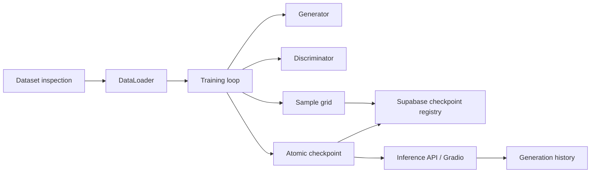

# GAN Image Studio

GAN Image Studio is a portfolio project for training a DCGAN, tracking training
artifacts, and exploring a checkpoint's latent space through FastAPI and Gradio.

The current model is a DCGAN on CIFAR-10 or a folder dataset. The package keeps
data loading, model definitions, training, inference, evaluation, and Supabase
persistence in separate modules so WGAN-GP can be added later without replacing
the whole training surface.

## Architecture



## Training Flow

1. Inspect a folder dataset before training, or use CIFAR-10 from Torchvision.
2. Normalize training images to `[-1, 1]`, matching the generator's `Tanh`
   output interval.
3. Update the discriminator first with detached fake images.
4. Update the generator against fresh discriminator scores.
5. Log losses to TensorBoard, save fixed-seed sample grids, and save
   checkpoints atomically.
6. Register a checkpoint in Supabase only after the local checkpoint has been
   loaded, validated, hashed, and moved into place.

## Commands

Install:

```bash
uv sync --extra dev
npm install
```

Inspect a folder dataset:

```bash
uv run gan-studio inspect-data datasets/custom --image-size 32
```

Quick CPU smoke training:

```bash
uv run gan-studio train --quick-cpu
```

Train on CIFAR-10:

```bash
uv run gan-studio train --dataset cifar10 --epochs 10 --batch-size 64
```

Resume from a checkpoint:

```bash
uv run gan-studio train --dataset cifar10 --epochs 20 --resume-checkpoint checkpoints/dcgan-epoch-0004-step-005000.pt
```

Generate from a checkpoint:

```bash
uv run gan-studio generate checkpoints/dcgan-epoch-0000-step-000500.pt --seed 42 --count 16
```

Run the API:

```bash
uv run gan-studio api --host 127.0.0.1 --port 8000
```

Run the Gradio UI:

```bash
uv run gan-studio ui
```

Verify:

```bash
uv run ruff check .
uv run pytest
npm run typecheck:scripts
npm run verify:supabase
```

## Supabase

This project must use a new, exclusive Supabase project. The repository includes:

- `scripts/provision-supabase.ts`
- `scripts/verify-supabase.ts`
- `supabase/config.toml`
- `supabase/migrations`
- `supabase/seed.sql`
- `supabase/functions/checkpoint-upload`
- `docs/supabase-setup.md`

Tables:

- `profiles`
- `experiments`
- `experiment_metrics`
- `model_checkpoints`
- `generations`
- `generation_favorites`
- `evaluation_reports`

Storage buckets:

- `generated-images`
- `training-samples`
- `model-checkpoints`
- `evaluation-assets`

All public tables enable RLS and include explicit Data API grants. Private
generations are visible only to their owner. Public experiments must be
published through `experiments.is_public`. Checkpoint uploads are backend-only.

## Evaluation

`gan_image_studio.evaluation` computes FID from feature tensors and can extract
Inception features with Torchvision. Small sample counts are reported as
non-representative so the project does not overstate quality or diversity.

## Evolution Images

Training sample grids are written to `outputs/samples` at a fixed seed. This
repository does not include generated result claims until a real training run is
executed and the artifacts are committed or linked.

## Results

No final model quality result is claimed yet. Run a real training job, inspect
TensorBoard, review sample grids over time, and compute FID with enough samples
before writing conclusions.

## Dataset License

CIFAR-10 is the default Torchvision dataset. Review its upstream license and
citation terms before publishing generated results. Custom folder datasets must
come from known, documented sources with a license that allows model training.

## Model Card

- Model: DCGAN
- Default dataset: CIFAR-10
- Intended use: portfolio demonstration and generative modeling experiments
- Out of scope: production image generation, identity-sensitive generation, or
  quality claims without representative evaluation
- Known limitations: DCGANs can suffer from mode collapse, unstable losses, and
  low-resolution outputs
- Evaluation: FID plus visual sample-grid inspection, with sample-count warnings

## Signs of Mode Collapse

- Generator loss decreases while samples become visually identical.
- Fixed-seed grids stop changing across many checkpoints.
- Discriminator loss stays near zero for long periods.
- Interpolations jump between a few repeated outputs instead of changing
  smoothly.

## Roadmap to WGAN-GP

- Add a loss strategy interface with DCGAN BCE and WGAN critic losses.
- Replace discriminator output semantics with critic scores.
- Add gradient penalty calculation and critic update ratio.
- Track Wasserstein estimate separately from generator/discriminator losses.
- Add tests for gradient penalty shape, finite gradients, and critic update
  scheduling.

## Limitations

- The default quick CPU mode is for smoke tests, not image quality.
- FID from small samples is only a regression signal.
- Remote Supabase provisioning requires explicit organization, cost, and region
  confirmation before creating the project.
